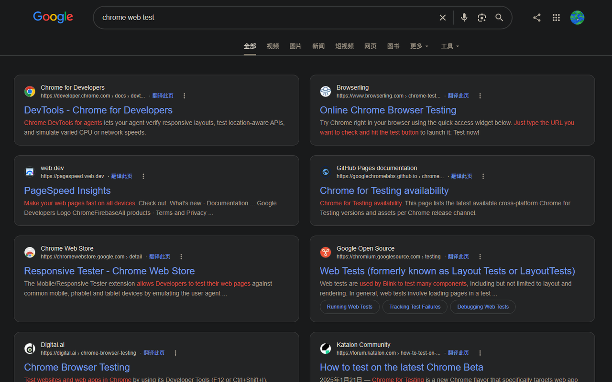

# SearchLayout

A Chrome extension that makes **Baidu and Google desktop web search results** easier to read — rearrange organic results into a single or dual column, and optionally auto-append the next page on the same screen.



[中文说明](./README.md) · [Privacy Policy](./PRIVACY.md)

## Features

- **Column modes**: Original / Single / Single-center / Double (results as cards)
- **Auto-page**: When you scroll near the bottom, the next page of organic results is appended on the same page
- **Instant preferences**: Change settings from the toolbar popup; stored in `chrome.storage` and can sync with your Chrome account

Defaults: single-center layout + auto-page on. Highlight is currently off.

## Scope

Desktop **web search result pages** only:

| Engine | Matches                                                              |
| ------ | -------------------------------------------------------------------- |
| Baidu  | `www.baidu.com/s*`                                                   |
| Google | `google.com` / `www.google.com` and common regional `/search*` hosts |

Not supported: image / video / news / maps verticals, mobile pages, the search homepage, or destination sites after you click a result.

## Install (unpacked / development)

1. Install dependencies and build:

```bash
npm install
npm run build
```

2. Open Chrome → `chrome://extensions`
3. Enable **Developer mode**
4. **Load unpacked** → select the `extension` or `dist` folder in this repo

After code changes, run `npm run build` again and click **Reload** on the extension card.

## Development

| Command         | Description                                                     |
| --------------- | --------------------------------------------------------------- |
| `npm run build` | Bundle `content.js` / `popup.js` with esbuild and write `dist/` |
| `npm test`      | Run Node’s built-in test runner (linkedom)                      |

Layout:

```text
src/                 # Source (content, popup, session, boot, …)
extension/           # Loadable extension (manifest, CSS, icons, build output)
test/                # Tests
scripts/build.mjs    # Build script
PRIVACY.md           # Privacy policy
```

## Permissions

- `storage` — save layout and auto-page preferences
- Content scripts inject only on Baidu / Google search result pages to rearrange results and optionally fetch the next page in-browser

The extension does **not** upload your queries or page content to a developer server. See [PRIVACY.md](./PRIVACY.md).

## License

[MIT](./LICENSE)
