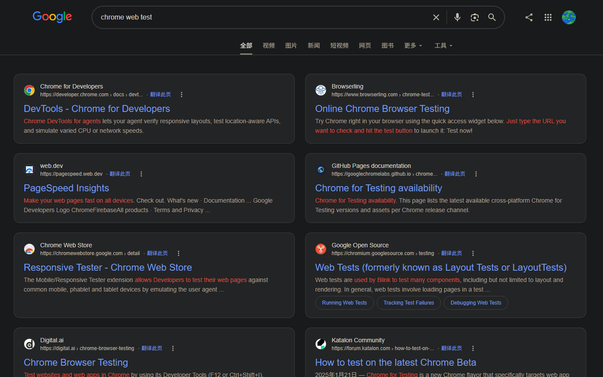

# SearchLayout

A Chrome extension that makes **Google, Bing, and DuckDuckGo desktop web search results** easier to read with single- and dual-column layouts and optional automatic pagination.



[中文说明](./README.md) · [Privacy Policy](./PRIVACY.md)

## Features

- **Quick presets**: Simple / Focused reading / Minimal distractions adjust card density, column width, and content visibility. Set the layout separately on the main popup screen, and set automatic pagination, paging options, and result opening under Advanced.
- **Page-only domain hiding**: Open Advanced → Hide domains on this page, enter domains such as `pinterest.com` or `zhihu.com`, then select Apply. Filtering includes subdomains and appended results. Select Restore all to clear the rules for the current page.
- **Special result blocks**: Separate switches for People Also Ask, video carousels and featured snippets. Recognized blocks can be expanded in place and restored without replacing their nodes.
- **Column modes**: Original / Single / Single-center / Double (results as cards)
- **Auto-page**: Append the next page of organic results as you scroll near the bottom. Turn off auto-page to restore native pagination controls
- **DuckDuckGo**: When the native More Results button is available, auto-page follows the extension’s batch settings. DuckDuckGo controls loading when its own Infinite Scroll setting is enabled
- **Baidu**: All four desktop web search layouts and automatic pagination are available. Centered modes align the search box, navigation, and filters. Custom layouts hide recognized related-search modules
- **Loading status**: See the number of appended pages, retry failed requests, continue after each 10-page pause, or return to the top
- **Instant preferences**: Change settings from the toolbar popup; stored in `chrome.storage` and can sync with your Chrome account
- **Reading appearance**: Compact / Comfortable / Relaxed, with an optional 320–1600px maximum per-column width (blank uses automatic width)
- **Visibility controls**: Google knowledge sidebar, Bing sidebar, and Google AI Overview
- **Ads**: Keep, collapse, or dim explicitly identified top/bottom ad areas locally; collapsed ads can be expanded and original nodes are restored when disabled
- **Pagination settings**: 1–50 pages per batch, 0–3000px bottom threshold, and optional automatic continuation while near the bottom
- **Result opening**: Engine default, current tab, new tab, or background tab for organic result titles. New/background tabs preserve the results page; modifier and middle clicks keep browser behavior
- **Pinned related searches**: Copy recognized related queries into a fixed bottom bar with horizontal scrolling on narrow screens; keep the original links
- **Site identity**: Domain badges use an existing result icon when available, then try the destination site's HTTPS `/favicon.ico`. If neither image loads, the badge shows the site's initial.
- **Visited links**: Optional muted link colors using CSS `:visited`, plus a page-session “opened” mark after successful new/background tab creation. Destination URLs stay in page memory only and are cleared on reload or session teardown; no history permission, history access, or persistent click records. Opening a tab does not confirm the destination loaded successfully

Defaults: single-center layout + auto-page on.

Domain hiding and block folding only change the local DOM, without additional requests or permissions. They do not prevent engine requests. Domain rules and hidden counts stay in memory and are exchanged locally between the popup and active search tab and clear on reload, search navigation or session teardown; they are never saved, synced or uploaded. Popup appearance and folding preferences still use Chrome storage and may sync. All three block switches default to off; unrecognized structures remain unchanged. Detailed navigation options are under Advanced → Results & navigation.

Result opening defaults to the engine's behavior; pinned queries, site badges and visited colors are opt-in in “Results & navigation”. Opening preferences affect organic titles only. A background service worker opens tabs without additional `tabs` permission. The related bar appears only when supported related-search containers contain valid queries.

New defaults preserve the existing card layout: comfortable density, automatic width, Google sidebar and AI visible, Bing sidebar hidden, ads unchanged, 10 pages per batch, an 800px threshold, and a pause after each batch. Existing preferences receive these defaults automatically. Sidebar, AI and ad visibility are independent of column mode, including Original. Visibility settings do not block engine requests. Ad handling uses explicit engine markers, never text matching; unrecognized structures are left unchanged.

## Scope

Desktop **web search result pages** only:

| Engine | Matches                                                              |
| ------ | -------------------------------------------------------------------- |
| Google | `google.com` / `www.google.com` and common regional `/search*` hosts |
| Bing   | `www.bing.com` / `cn.bing.com` `/search*`                            |
| DuckDuckGo | `duckduckgo.com` root path with a search query |
| Baidu | `baidu.com` / `www.baidu.com` `/s` |

Not supported: image / video / news / maps verticals, mobile pages, the search homepage, or destination sites after you click a result.

## Install (unpacked / development)

1. Install dependencies and build:

```bash
npm install
npm run build
```

2. Open Chrome → `chrome://extensions`
3. Enable **Developer mode**
4. **Load unpacked** → select the `extension` or `dist` folder in this repo

After code changes, run `npm run build` again and click **Reload** on the extension card.

## Development

| Command         | Description                                                     |
| --------------- | --------------------------------------------------------------- |
| `npm run build` | Bundle `content.js` / `popup.js` / `background.js` with esbuild and write `dist/` |
| `npm test`      | Run Node’s built-in test runner (linkedom)                      |
| `npm run lint` | Lint source, scripts and tests |
| `npm run sync` | Synchronize versions, host permissions and CSS dimensions |
| `npm run test:browser` | Run local Chromium layout regression tests |
| `npm run test:live` | Check live search pages after building; verification pages may block access |

Use Node.js 24+. Unit tests automatically discover `test/**/*.test.mjs`; browser tests run separately. The manifest version is authoritative: change only `extension/manifest.json`, then run `npm run sync` or `npm run build` and commit the synchronized package and lockfile. Supported hosts live in `src/search-hosts.mjs`; shared layout dimensions live in `src/layout-constants.mjs`. The build updates manifest matches and the generated CSS block. Popup and loading status share the saved `uiLocale` and update immediately.

PRs and pushes run lint, unit tests, build and generated-file consistency checks in GitHub Actions. Browser and live checks are optional workflow-dispatch inputs. Layout implementation is separated into boot, shell, navigation, search field, Bing and DOM observer modules; `content-boot.mjs` preserves the original exports.

Layout:

```text
src/                 # Source (content, popup, session, boot, …)
extension/           # Loadable extension (manifest, CSS, icons, build output)
test/                # Tests
scripts/build.mjs    # Build script
PRIVACY.md           # Privacy policy
```

## Permissions

- `storage` — save layout and auto-page preferences
- Content scripts run on matching Google, Bing, DuckDuckGo, and Baidu web searches

The extension does **not** upload your queries or page content to a developer server. See [PRIVACY.md](./PRIVACY.md).

## License

[MIT](./LICENSE)
